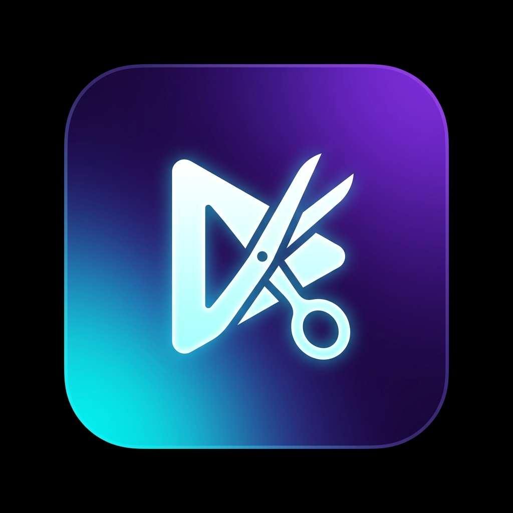

# 🎬 Stream Auto Cutter v2.2.0

<p align="center">
  
</p>

<p align="center">
  <b>Высокопроизводительное десктопное приложение для быстрой автоматической нарезки видео, стримов и ролика для соцсетей.</b>
</p>

<p align="center">
  
  
  
  
</p>

---

## 🔥 Главные возможности

- ⚡ **Мгновенная нарезка (`-c copy`)**: нарезка 16-минутного 4K сегмента за **1–2 секунды** без перекодирования.
- 🚀 **Hardware GPU Decoding**: аппаратный декод видео напрямую в памяти видеокарты — **NVIDIA CUDA** на Windows и **Apple Silicon Media Engine (VideoToolbox)** на macOS.
- 📊 **Индикация прогресса и ETA**:
  - Предварительный анализ всей очереди до старта.
  - Точное отображение оставшегося времени, скорости рендера (например `3.2x`) и номеров кусков.
- 🖼️ **Мульти-наложение логотипов**: гибкая позиционка (углы, центр), прозрачность, угол наклона, хромакей (зелёный/синий/чёрный фон), показ по времени или только на сегмент.
- 🎬 **Интро и Аутро**: добавление начальных и финальных заставок с автоподгонкой разрешения и FPS.
- 📲 **Пакетный автозагрузчик в ВКонтакте**: автоматическая публикация нарезанных частей в VK со списком названий.
- 📦 **Всё включено (Portable / Standalone)**: FFmpeg и FFprobe уже зашиты внутрь `.exe` файла — ничего лишнего скачивать не нужно!

---

## 📥 Скачать и запустить (Windows)

1. Перейдите в раздел **[Releases](../../releases/latest)**.
2. Скачайте файл **`StreamAutoCutter.exe`**.
3. Запустите двойным кликом — установка не требуется!

> 💡 **Обновление:** При выходе новой версии просто замените `.exe` файл. Ваши настройки сохранится в `settings.json` рядом.

---

## 🛠️ Запуск из исходного кода (для разработчиков)

### Требования
- Python 3.10+
- FFmpeg (в системе или в папке проекта)

### Установка и запуск

```bash
# 1. Клонировать репозиторий
git clone https://github.com/Roycce/video_pipeline.git
cd video_pipeline

# 2. Установить зависимости
pip install -r requirements.txt

# 3. Запустить приложение
python main.py
```

### Сборка standalone .exe (PyInstaller)

```cmd
pyinstaller --onefile --windowed --name StreamAutoCutter ^
  --icon icon.ico ^
  --version-file file_version_info.txt ^
  --add-binary "ffmpeg.exe;." ^
  --add-binary "ffprobe.exe;." ^
  --add-data "icon.png;." ^
  main.py
```

---

## 📄 Лицензия

MIT License © 2026 Roycce. Created for fast stream video editing & auto-publishing.
